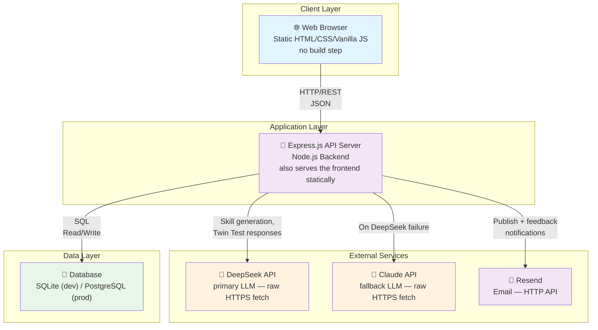

# THE 42 POST

[](https://github.com/xiaojialove-DRP/the42post/actions/workflows/ci.yml)

**An open-source platform for human-centered AI value alignment.**

🌐 [中文版本](./README.zh.md) · [Live Platform](https://the42post.com) · [Report Issues](https://github.com/xiaojialove-DRP/the42post/issues)

> Built on [SemanticForge](https://github.com/xiaojialove-DRP/SemanticForge) — THE 42 POST implements SemanticForge's five-layer framework as a community platform where anyone can create and share AI-aligned skills.

---

## What is THE 42 POST?

THE 42 POST is a web platform where anyone can create **Skills** — structured, verifiable representations of human values that guide AI behavior. Instead of burying values inside training data, THE 42 POST makes them explicit, shareable, auditable, and culturally diverse.

### Features

- **Skill Forge** — Turn your values into verifiable AI guidance in 4 guided steps
- **Skill Library** — Browse a growing library of community-created skills across domains ([live count](https://the42post.com/api/analytics/public-stats))
- **Twin Test Playground** — Compare two skills side-by-side to see how they change AI responses
- **Soul-Hash Identity** — Each published skill receives a unique 14-character identity
- **Creator Card** — Downloadable proof-of-contribution with skill summary and email delivery

---

## Why We Built This

**The problem:** AI values are hidden in training data, inconsistent across cultures, unverifiable, and controlled by a small number of organizations.

**Our answer:** Democratize AI alignment by making values explicit, auditable, and community-authored. No coding required — just your perspective as a human.

---

## Why We Keep This Open

THE 42 POST is not a commercial product. We believe AI value alignment should be:

- **Owned by everyone** — not by a handful of large corporations
- **Research-driven** — not optimized for commercial algorithms
- **Culturally diverse** — shaped by a global community
- **Verifiable and auditable** — not a black box

That is why we open-sourced it.

---

## Getting Started

No setup required. Visit [the42post.com](https://the42post.com):

1. **Browse** community skills in the Skill Library
2. **Create** your first skill using the Skill Forge (5–10 min)
3. **Test** behavior in the Twin Test Playground
4. **Publish** and receive your Soul-Hash + Creator Card

---

## Self-Hosting

```bash
git clone https://github.com/xiaojialove-DRP/the42post.git
cd the42post/backend
cp .env.example .env       # fill in DEEPSEEK_API_KEY and other vars
npm install
npm start
```

See [docs/SETUP.md](docs/SETUP.md) for full environment configuration and [docs/guides/DEPLOYMENT.md](docs/guides/DEPLOYMENT.md) for production deployment.

---

## Architecture



```
frontend/          Static HTML/CSS/JS — no build step required
backend/
  routes/          REST API endpoints
  utils/           LLM calls (DeepSeek/Claude), email, cache, validation
  middleware/       Rate limiting, error handling
  db/              SQLite/PostgreSQL schema and seed data
docs/              Architecture, API reference, guides
```

Full system design: [docs/ARCHITECTURE.md](docs/ARCHITECTURE.md)  
REST API reference: [docs/API_REFERENCE.md](docs/API_REFERENCE.md)

---

## Contributing

We welcome contributions from creators, developers, and researchers.

- **Skill creators** — Design and publish skills through the platform
- **Developers** — Fork, submit PRs, improve the platform
- **Researchers** — Download skills via API, run experiments, share findings

See [docs/CONTRIBUTING.md](docs/CONTRIBUTING.md) for guidelines.

---

## Documentation

| Document | Description |
|---|---|
| [docs/ARCHITECTURE.md](docs/ARCHITECTURE.md) | System design and data flows |
| [docs/API_REFERENCE.md](docs/API_REFERENCE.md) | REST API endpoints |
| [docs/CONCEPTS.md](docs/CONCEPTS.md) | Core concepts: Skills, Soul-Hash, five-layer structure |
| [docs/SETUP.md](docs/SETUP.md) | Local development setup |
| [docs/guides/DEPLOYMENT.md](docs/guides/DEPLOYMENT.md) | Production deployment |
| [docs/CONTRIBUTING.md](docs/CONTRIBUTING.md) | Contribution guidelines |
| [docs/product-guide.md](docs/product-guide.md) | End-user product guide (Chinese only) |
| [CHANGELOG.md](CHANGELOG.md) | Release history |

---

## Governance

| Document | Description |
|---|---|
| [docs/governance/DATA_LICENSE.md](docs/governance/DATA_LICENSE.md) | How skills and research data are licensed (CC, per author's choices) |
| [docs/governance/MODERATION_POLICY.md](docs/governance/MODERATION_POLICY.md) | What is and isn't allowed, and how review actually works |
| [docs/governance/PARTICIPANT_DATA.md](docs/governance/PARTICIPANT_DATA.md) | What data is collected, research use, your choices |

---

## License

MIT — see [LICENSE](LICENSE)

---

*Making AI values transparent, verifiable, and human-centered.*
