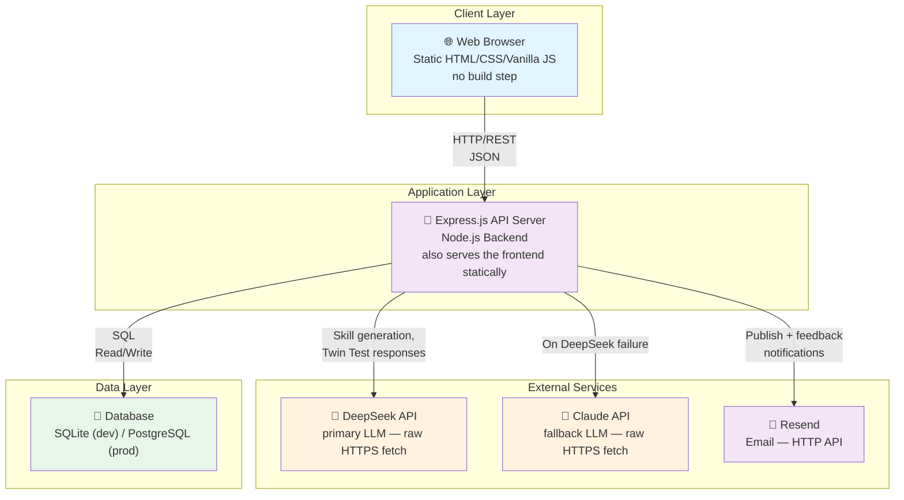

# THE 42 POST 🛸

[](https://github.com/xiaojialove-DRP/the42post/actions/workflows/ci.yml)

**一个人人可参与锻造 AI 价值观的开放研究平台**

让普通人参与定义、分享和验证 AI 系统的价值观。

🌐 **[English Version](./README.md)**

> **基于 [SemanticForge](https://github.com/xiaojialove-DRP/SemanticForge)** — THE 42 POST 将 SemanticForge 的五层框架实现为一个社区平台，让任何人都能创建和分享与 AI 对齐的技能。

---

## 🎯 THE 42 POST 是什么？

THE 42 POST 是一个开放平台，让任何人都能创建"技能"（Skills）—— 人类价值观、原则和伦理准则的结构化、可验证的表示，用来改进 AI 的行为。与其让 AI 的价值观隐含在训练数据中，THE 42 POST 将它们变得显式、可共享、可验证且跨文化。

### 核心功能

- 🛠️ **技能锻造工作坊** — 四步指导流程将您的想法转化为结构化技能
- 📚 **技能库** — 发现 42+ 由普通人、设计师、伦理学家创建的示例技能
- 👁️ **预览和迭代** — 发布前查看完整的五层结构，基于反馈精细调整
- 🤖 **AI 就绪** — 使用影子智能体测试行为或集成到您的系统

---

## ❓ 为什么我们构建这个？

**问题：** AI 的价值观隐藏在训练数据中，跨文化不一致，无法验证，由少数组织控制。

**解决方案：** 我们民主化 AI 价值观对齐，让每个人——从普通用户到伦理学家——都能塑造 AI 行为，无需技术背景。

---

## 🚀 快速开始

**无需任何安装。** 访问 [THE 42 POST](https://www.the42post.com)：

1. **浏览** 42+ 技能库（2 分钟）
2. **创建** 您的第一个技能，使用技能锻造（5-10 分钟）
3. **发布** 并获得您的 Soul-Hash 身份（1 分钟）

---

## 🏗️ 自托管

```bash
git clone https://github.com/xiaojialove-DRP/the42post.git
cd the42post/backend
cp .env.example .env       # 填入 DEEPSEEK_API_KEY 等环境变量
npm install
npm start
```

完整的环境配置见 [docs/SETUP.md](docs/SETUP.md)，生产部署见 [docs/guides/DEPLOYMENT.md](docs/guides/DEPLOYMENT.md)。

---

## 💭 为什么我们坚持做这个开放研究项目

THE 42 POST 不是商业产品。我们相信 AI 价值观对齐应该是：
- **由所有人拥有**，而不是公司
- **基于研究**，而不是商业算法
- **文化多样**，由全球社群塑造
- **可验证和可审计**，而不是黑盒

这就是我们开源它的原因。

---

## 📚 系统架构



和 [docs/ARCHITECTURE.md](docs/ARCHITECTURE.md) 用的是同一份图——只在一处维护，不会出现两边不同步的情况。详细的系统设计、数据流和数据库模式，请查看 [docs/ARCHITECTURE.md](docs/ARCHITECTURE.md)。

---

## 📖 如何使用 THE 42 POST

### 技能发现者
- **搜索库** — 按领域、创建者或关键词查找技能
- **阅读详情** — 了解五层结构、示例和社区反馈
- **体验技能** — 使用影子智能体看技能如何引导 AI 行为
- **评价和分享** — 提供反馈和推荐

### 创建者
1. **点击"技能锻造"** 并输入您的核心想法
2. **AI 生成** 五层结构（定义、场景、边界、验证、文化适配）
3. **预览和精细调整** 发布前的内容
4. **发布** 并获得您的 Soul-Hash 身份 + 创建者卡

### 研究员
- **分析模式** — 跨 42+ 技能发现规律
- **研究有效性** — 使用测试用例和影子智能体
- **API 访问** — 获取 JSON 格式的技能数据（`/api/skills`, `/api/search`）
- **发布发现** — 贡献人类中心 AI 研究

### 开发者
- **集成技能** — 使用 REST API 将技能融入您的 AI 智能体
- **运行测试用例** — 验证行为对齐
- **与创建者协作** — 完善技能

---

## 🤝 贡献

我们欢迎来自创建者、开发者和研究员的贡献：

- **技能创建者：** 在平台上设计和发布技能
- **开发者：** Fork 仓库，提交 PR，改进平台
- **研究员：** 下载技能，运行实验，分享发现

---

## 📄 许可证

MIT 许可证 — 详见 [LICENSE](LICENSE) 文件

---

## 📚 文档

- **[系统架构](docs/ARCHITECTURE.md)** — 系统设计和数据流
- **[核心概念](docs/CONCEPTS.md)** — Skill、Soul-Hash、五层结构
- **[API 参考](docs/API_REFERENCE.md)** — REST API 端点集成
- **[本地开发环境](docs/SETUP.md)** — 本地开发环境搭建
- **[生产部署指南](docs/guides/DEPLOYMENT.md)** — 生产环境部署
- **[贡献指南](docs/CONTRIBUTING.md)** — 如何参与（创建者、设计师、开发者、研究员）
- **[产品使用说明](docs/product-guide.md)** — 面向普通用户的完整操作指南
- **[更新日志](CHANGELOG.md)** — 每个版本的新功能

---

## 🏛️ 治理

- **[数据与内容许可](docs/governance/DATA_LICENSE.md)** — Skill 按作者选择映射 CC 协议；研究数据只做聚合发布
- **[内容审核政策](docs/governance/MODERATION_POLICY.md)** — 什么允许、什么禁止、审核如何真实运作
- **[参与者数据说明](docs/governance/PARTICIPANT_DATA.md)** — 收集什么、研究用途、你的选择

---

## 🔗 快速链接

- **🌐 访问平台**: [https://www.the42post.com](https://www.the42post.com)
- **📦 GitHub 仓库**: https://github.com/xiaojialove-DRP/the42post
- **🐛 反馈问题**: [GitHub Issues](https://github.com/xiaojialove-DRP/the42post/issues)

---

## 🙏 致谢

THE 42 POST 汇集了价值观敏感设计、参与式设计、跨文化人机交互和 AI 对齐研究，使价值观定义对所有人都可访问。特别感谢所有为技能库贡献技能的创建者。

---

*让 AI 的价值观透明、可验证、以人为中心。*
