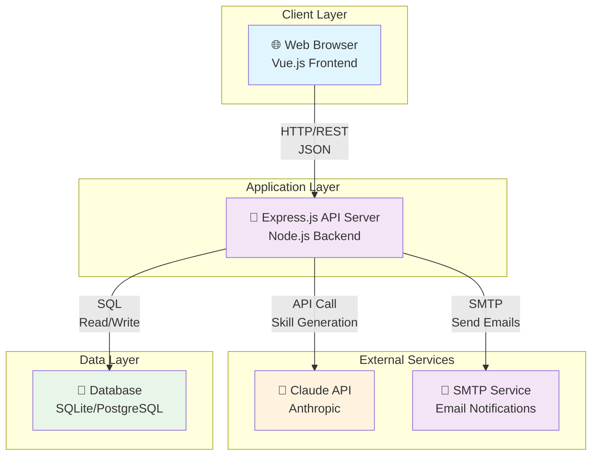
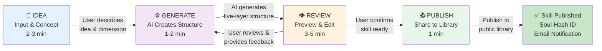
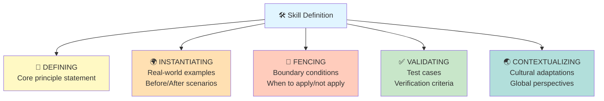
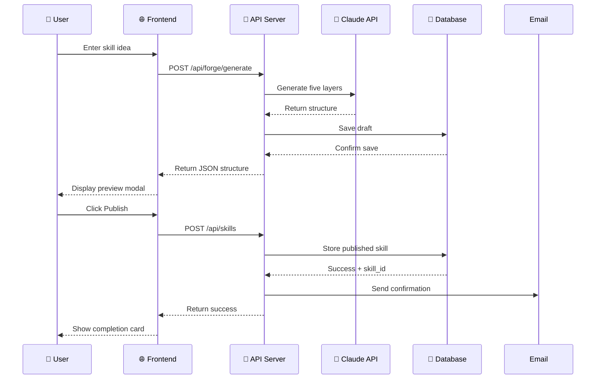
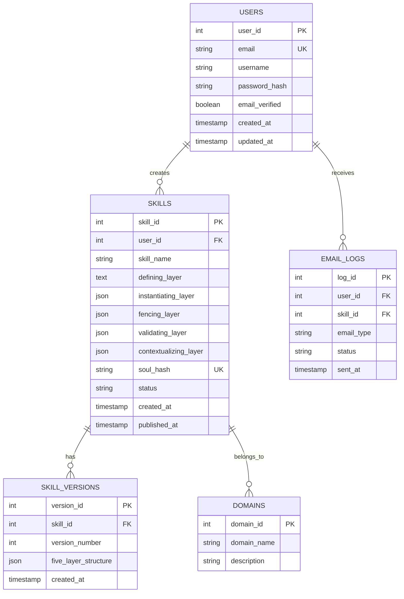
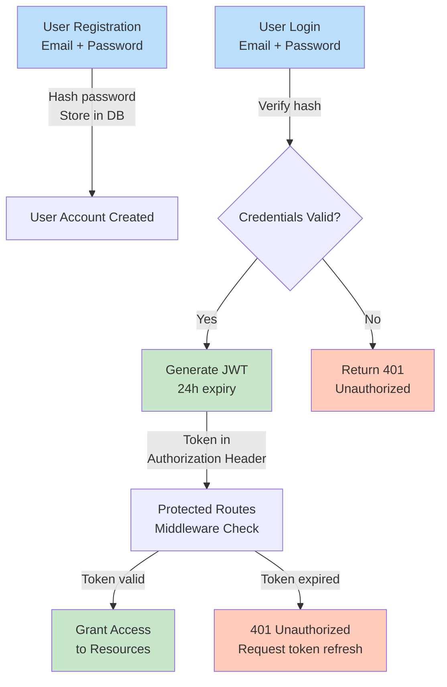
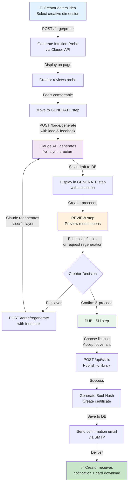
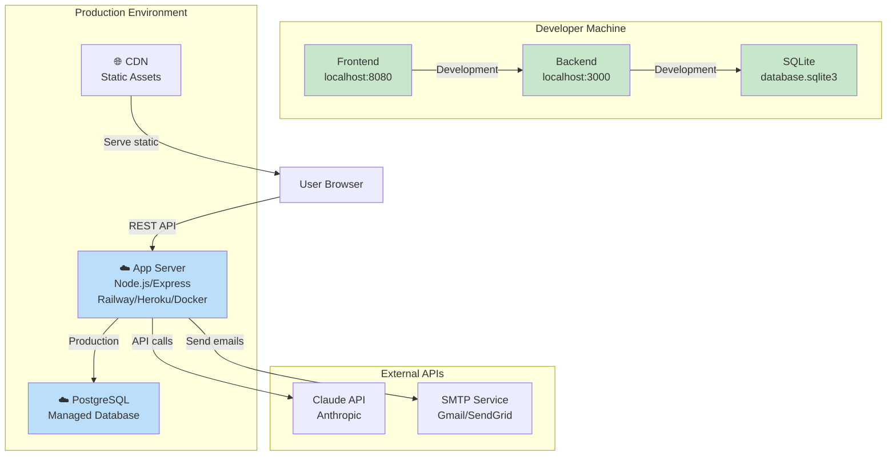

# System Architecture

THE 42 POST is a distributed, human-centered AI value alignment platform combining frontend interactivity, backend API services, external AI integration, and database persistence.

---

## 🏗️ System-Level Architecture



---

## 🔄 Skill Forging Workflow (4-Step Process)



---

## 🎯 Five-Layer Skill Structure



---

## 📡 API Architecture

### Core API Routes

```
┌─ /api/auth
│  ├─ POST /register         (Create new user account)
│  ├─ POST /login            (User authentication)
│  └─ POST /refresh          (Token refresh)
│
├─ /api/skills
│  ├─ GET /                  (List all skills)
│  ├─ GET /:id               (Get specific skill)
│  ├─ POST /                 (Create new skill)
│  ├─ PATCH /:id             (Update skill)
│  └─ DELETE /:id            (Delete skill)
│
├─ /api/forge
│  ├─ POST /probe            (Generate intuition probe)
│  ├─ POST /generate         (Generate five-layer structure)
│  └─ POST /regenerate       (Regenerate specific layer)
│
├─ /api/search
│  ├─ GET /                  (Search skills)
│  └─ GET /domains           (List all domains)
│
├─ /api/email
│  ├─ POST /send-forge-success    (Send publish notification)
│  └─ GET /certificate/:id        (Download creator certificate)
│
└─ /api/agents
   └─ POST /shadow-probe     (Test skill with Shadow Agent)
```

### Request/Response Flow



---

## 💾 Database Schema



---

## 🔐 Authentication & Authorization Flow



---

## 📊 Data Flow: Complete Skill Creation Journey



---

## 🗂️ Project Structure

### Frontend (`frontend/`)
```
frontend/
├── index.html              (Main application - 850 lines)
├── script.js               (App logic - 6,567 lines)
├── styles.css              (Responsive design - 134 KB)
├── arena.html              (Shadow Agent experience page)
├── skills.js               (Sample skills data)
└── utils/                  (Helper functions)
```

### Backend (`backend/`)
```
backend/
├── server.js               (Express app entry point)
├── routes/
│   ├── auth.js             (Register, login, refresh)
│   ├── skills.js           (CRUD operations)
│   ├── forge.js            (Skill generation)
│   ├── search.js           (Discovery & filtering)
│   ├── email.js            (Notifications)
│   └── agents.js           (Shadow Agent API)
├── utils/
│   ├── email-service.js    (Nodemailer config)
│   ├── certificate.js      (Certificate generation)
│   └── jwt-utils.js        (Token management)
├── middleware/
│   ├── auth.js             (JWT verification)
│   ├── error-handler.js    (Error management)
│   └── logger.js           (Request logging)
├── db/
│   └── init.js             (SQLite/PostgreSQL schema)
└── .env.example            (Configuration template)
```

---

## 🔄 Integration Points

### Claude API Integration
- **Endpoint**: `https://api.anthropic.com/v1/messages`
- **Use Cases**:
  - Generate intuition probes from user ideas
  - Create five-layer skill structures
  - Regenerate specific layers based on feedback
- **Model**: Claude 3.5 Sonnet
- **Rate Limiting**: Based on Anthropic API plan

### Email Service Integration
- **Provider**: Nodemailer (SMTP compatible)
- **Supported**: Gmail, SendGrid, custom SMTP
- **Dev Mode**: Console logging (no actual sending)
- **Templates**:
  - Skill publication confirmation
  - Creator certificate download link
  - Feedback notifications

### Database Flexibility
- **Development**: SQLite (file-based, zero configuration)
- **Production**: PostgreSQL (scalable, enterprise-ready)
- **Migration**: Connection string via `DATABASE_URL`

---

## 📈 Deployment Architecture



---

## 🔍 Key Design Decisions

| Decision | Rationale | Trade-offs |
|----------|-----------|-----------|
| **Frontend: Vue.js + Vanilla JS** | Lightweight, no build step, fast dev | Limited for large-scale complexity |
| **Backend: Express.js** | Minimal, flexible, large ecosystem | Less opinionated than frameworks |
| **DB: SQLite + PostgreSQL** | SQLite for dev simplicity, PostgreSQL for prod scale | Migration complexity |
| **JWT Auth** | Stateless, scalable, works with multiple servers | No server-side session control |
| **Claude API** | State-of-the-art AI, best for creative generation | External dependency, API costs |
| **Nodemailer** | Simple, flexible, supports multiple providers | Not a managed service |
| **Five-Layer Structure** | Domain-specific, human-centered, verifiable | More complex than flat structure |

---

## 🚀 Performance Considerations

- **Frontend**: CSS-in-style, minimal JavaScript (vanilla)
- **Backend**: Async/await, connection pooling for DB
- **Database**: Indexed queries on `user_id`, `skill_id`, `email`
- **API**: Compression, caching headers for static assets
- **External APIs**: Implement retry logic, error handling

---

## 🔒 Security Considerations

- **Authentication**: JWT with 24h expiry, refresh tokens
- **Database**: Parameterized queries (prevent SQL injection)
- **Passwords**: Bcrypt hashing, never stored in plain text
- **Environment Variables**: `.env` file (never committed to git)
- **CORS**: Configured to allow frontend domain only
- **Rate Limiting**: Implement on `/api/auth` and `/api/forge` endpoints

---

**Last Updated**: 2026-04-20  
**Version**: 1.0.0
