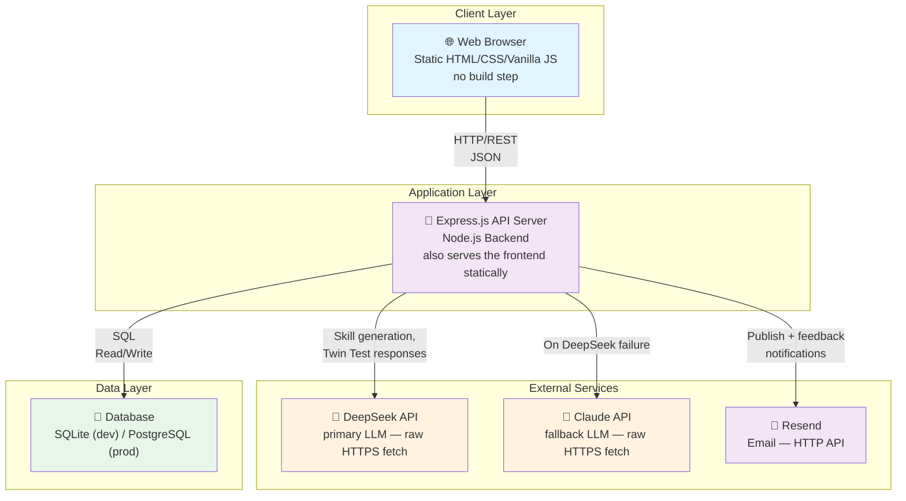
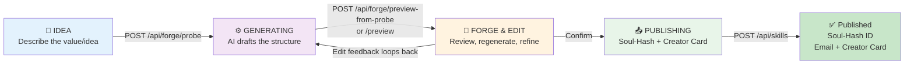
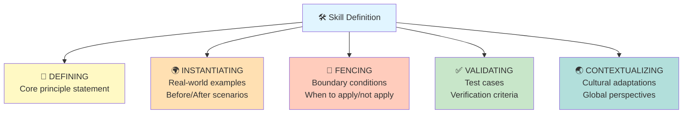
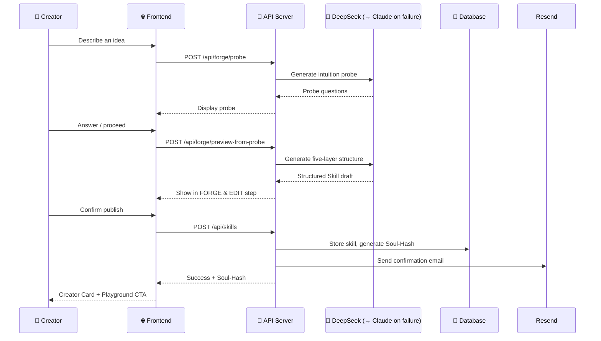
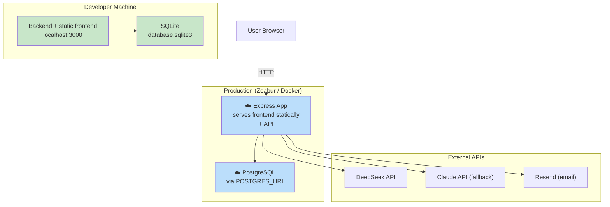

# System Architecture

THE 42 POST is a research platform for human-centered AI value alignment: anyone can author a **Skill** (a structured statement of a value or principle) and test it head-to-head against a baseline AI response in the **Twin Test Playground**. The backend's job is mostly LLM orchestration and structured data collection, not a conventional CRUD app.

---

## 🏗️ System-Level Architecture


```mermaid
graph TB
    subgraph "Client Layer"
        Browser["🌐 Web Browser<br/>Static HTML/CSS/Vanilla JS<br/>no build step"]
    end

    subgraph "Application Layer"
        API["🔌 Express.js API Server<br/>Node.js Backend<br/>also serves the frontend statically"]
    end

    subgraph "External Services"
        DeepSeek["🤖 DeepSeek API<br/>primary LLM — raw HTTPS fetch"]
        Claude["🤖 Claude API<br/>fallback LLM — raw HTTPS fetch"]
        Resend["📧 Resend<br/>Email — HTTP API"]
    end

    subgraph "Data Layer"
        DB["💾 Database<br/>SQLite (dev) / PostgreSQL (prod)"]
    end

    Browser -->|HTTP/REST<br/>JSON| API
    API -->|Skill generation,<br/>Twin Test responses| DeepSeek
    API -->|On DeepSeek failure| Claude
    API -->|Publish + feedback<br/>notifications| Resend
    API -->|SQL<br/>Read/Write| DB

    style Browser fill:#e1f5ff
    style API fill:#f3e5f5
    style DeepSeek fill:#fff3e0
    style Claude fill:#fff3e0
    style Resend fill:#f3e5f5
    style DB fill:#e8f5e9
```

Neither LLM is called through an official SDK — both are plain `fetch()` calls against their REST endpoints (`api.deepseek.com/chat/completions`, `api.anthropic.com/v1/messages`). DeepSeek is primary; Claude is a fallback used when DeepSeek's call fails, not a load-balanced second option.

---

## 🪪 Identity Model

There's no public registration flow. The identity every creator actually uses is lighter-weight:


```mermaid
graph LR
    A["Creator provides<br/>email + username"] -->|POST /api/auth/forge-session| B["Find or create<br/>users row — no password"]
    B -->|Issues a real JWT| T["Bearer token"]
    T -->|Authorization header| C["Forge a Skill,<br/>fetch own skills, etc."]
    C -->|On publish| D["Generate Soul-Hash<br/>14-char identity"]
    D --> E["Creator Card<br/>proof of contribution"]

    style A fill:#e3f2fd
    style D fill:#c8e6c9
    style E fill:#c8e6c9
```

The JWT mechanism itself is very much live — `forge-session` issues a real token (`bcryptjs`/`jsonwebtoken` under the hood), and the frontend sends it as `Authorization: Bearer <token>` on follow-up calls like `GET /api/skills/user/skills`. **What's dormant specifically is the password path**: `POST /api/auth/login` checks a `password_hash` column that nothing in the live product ever populates, and `GET /api/auth/me` has no frontend caller either. Don't build against `/login` expecting real users to exist there — the identity that actually matters is the anonymous email+username pair from `forge-session`.

---

## 🔄 Skill Forging Workflow (4-Step Process)


```mermaid
graph LR
    Step1["🎯 IDEA<br/>Describe the value/idea"]
    Step2["⚙️ GENERATING<br/>AI drafts the structure"]
    Step3["🔧 FORGE & EDIT<br/>Review, regenerate, refine"]
    Step4["📤 PUBLISHING<br/>Soul-Hash + Creator Card"]

    Step1 -->|POST /api/forge/probe| Step2
    Step2 -->|POST /api/forge/preview-from-probe<br/>or /preview| Step3
    Step3 -->|Edit feedback loops back| Step2
    Step3 -->|Confirm| Step4
    Step4 -->|POST /api/skills| Result["✅ Published<br/>Soul-Hash ID<br/>Email + Creator Card"]

    style Step1 fill:#e3f2fd
    style Step2 fill:#f3e5f5
    style Step3 fill:#fff3e0
    style Step4 fill:#e8f5e9
    style Result fill:#c8e6c9
```

---

## 🎯 Five-Layer Skill Structure


```mermaid
graph TB
    Skill["🛠️ Skill Definition"]

    Layer1["📝 DEFINING<br/>Core principle statement"]
    Layer2["🌍 INSTANTIATING<br/>Real-world examples<br/>Before/After scenarios"]
    Layer3["🚧 FENCING<br/>Boundary conditions<br/>When to apply/not apply"]
    Layer4["✅ VALIDATING<br/>Test cases<br/>Verification criteria"]
    Layer5["🌏 CONTEXTUALIZING<br/>Cultural adaptations<br/>Global perspectives"]

    Skill --> Layer1
    Skill --> Layer2
    Skill --> Layer3
    Skill --> Layer4
    Skill --> Layer5

    style Skill fill:#e1f5ff
    style Layer1 fill:#fff9c4
    style Layer2 fill:#ffe0b2
    style Layer3 fill:#ffccbc
    style Layer4 fill:#c8e6c9
    style Layer5 fill:#b2dfdb
```

---

## 📡 API Architecture

### Mounted Routes (`backend/server.js`)

```
├─ /api/auth
│  ├─ POST /forge-session    (find-or-create anonymous identity — the real one)
│  ├─ POST /login            (dormant — no live caller, see Identity Model)
│  └─ GET  /me                (dormant — no live caller either, though a forge-session token would satisfy it)
│
├─ /api/forge
│  ├─ POST /probe                  (generate an intuition probe from the idea)
│  ├─ POST /probe/stream           (streaming variant)
│  ├─ POST /preview-from-probe     (build the five-layer structure)
│  ├─ POST /preview                (build it directly, skipping the probe step)
│  ├─ POST /save-probe-session     (persist probe interaction for research data)
│  └─ POST /blessing               (the short AI "blessing" line shown on the Creator Card)
│
├─ /api/skills
│  ├─ GET  /                       (list, with 5-minute in-memory cache)
│  ├─ GET  /:skill_id
│  ├─ POST /                       (publish)
│  ├─ GET  /user/skills             (requireAuth — works with a forge-session token)
│  ├─ POST /:skill_id/star, GET /:skill_id/stars, GET /stars/batch  (starring)
│  └─ PATCH /:skill_id, DELETE /:skill_id, GET /:skill_id/manifest  (edit/manage)
│
├─ /api/playground
│  ├─ POST /test               (run the Twin Test: baseline vs. skill response)
│  ├─ POST /vote                (record which response the user preferred)
│  ├─ POST /feedback            (optional free-text comment)
│  ├─ GET  /picker              (skill list for the "pick a skill" dropdown)
│  └─ GET  /stats/:skill_id, /stats-batch
│
├─ /api/email
│  └─ POST /send-forge-success  (publish confirmation + Creator Card, via Resend)
│
├─ /api/download/:skillId       (server-rendered Creator Card, downloadable)
│
└─ /health, /api/health         (uptime checks)
```

A handful of `/api/admin/*` routes (seeding, diagnostics, creator-name backfills) live directly in `server.js`, gated behind a `requireAdminKey` check — operational tooling, not part of the public API surface.

### Request/Response Flow: Forging a Skill


```mermaid
sequenceDiagram
    participant User as 👤 Creator
    participant Frontend as 🌐 Frontend
    participant API as 🔌 API Server
    participant LLM as 🤖 DeepSeek (→ Claude on failure)
    participant DB as 💾 Database

    User->>Frontend: Describe an idea
    Frontend->>API: POST /api/forge/probe
    API->>LLM: Generate intuition probe
    LLM-->>API: Probe questions
    API-->>Frontend: Display probe
    User->>Frontend: Answer / proceed

    Frontend->>API: POST /api/forge/preview-from-probe
    API->>LLM: Generate five-layer structure
    LLM-->>API: Structured Skill draft
    API-->>Frontend: Show in FORGE & EDIT step

    User->>Frontend: Confirm publish
    Frontend->>API: POST /api/skills
    API->>DB: Store skill, generate Soul-Hash
    API->>Resend: Send confirmation email
    API-->>Frontend: Success + Soul-Hash
    Frontend-->>User: Creator Card + Playground CTA
```

---

## 💾 Database

SQLite locally (zero config), PostgreSQL in production when `POSTGRES_URI` is set (`backend/db/connectionPool.js` / `sqlite-adapter.js` switch transparently). Real tables, by purpose rather than full column lists (see `backend/db/init.js` for exact schema):

| Table | Purpose |
|---|---|
| `users` | Anonymous-by-default creator identity (email + username); password fields exist but are unused in practice |
| `skills` | Published Skills — the five-layer structure, Soul-Hash, domain, etc. |
| `skill_versions` | Edit history for a Skill |
| `skill_manifests` | Export/packaging metadata |
| `probe_logs`, `probe_sessions` | Research data from the intuition-probe step |
| `skill_test_votes` | Twin Test results — which response (baseline vs. skill) the user preferred |
| `skill_feedback` | Optional free-text comments left after a Twin Test |
| `skill_usage_logs`, `user_skill_interactions` | Engagement tracking |
| `forging_histories` | Full record of a creator's forge session (idea, language, locale) |
| `moderation_logs` | Content-safety flags |

---

## 🔄 Integration Points

### LLM Integration
- **Primary**: DeepSeek (`deepseek-chat`, configurable via `DEEPSEEK_MODEL`) — plain `fetch()` against `api.deepseek.com`, no SDK
- **Fallback**: Claude (`api.anthropic.com/v1/messages`) — used when the DeepSeek call fails, not load-balanced
- **Use cases**: intuition probes, five-layer Skill generation, Twin Test baseline/skill responses, the Creator Card "blessing" line
- A multi-provider abstraction (`backend/utils/llmAdapter.js`, Gemini-era) and the `@google/generative-ai` dependency still exist in the repo but have no live caller — left over from an earlier provider, not part of the running system

### Email — Resend, not SMTP
- **Why**: Zeabur (the deploy target) blocks outbound SMTP ports (25/465/587) to prevent spam, so Nodemailer-style SMTP always times out there. Resend uses HTTPS, so it works.
- **Templates**: publish confirmation with the Creator Card attached

### Database Flexibility
- **Development**: SQLite, file-based, zero configuration
- **Production**: PostgreSQL via `POSTGRES_URI`
- **Caching**: skill list cached in-memory for 5 minutes, invalidated on publish

---

## 🗂️ Project Structure

### Frontend (`frontend/`)
```
frontend/
├── index.html              (Homepage + Skill Forge modal)
├── playground.html         (Twin Test Playground — drag-and-drop card canvas)
├── archive.html            (Skill Archive — browse/search published Skills)
├── script.js               (Shared app logic; large, single file, no build step)
├── styles.css
├── js/utils.js, utils/api.js   (small shared helpers)
└── skillStore.js, skills.js    (local skill data helpers)
```

### Backend (`backend/`)
```
backend/
├── server.js               (Express entry point; mounts routes, serves frontend statically)
├── routes/
│   ├── auth.js             (forge-session — the real identity flow; login/me are dormant)
│   ├── forge.js             (probe, preview, blessing — Skill generation)
│   ├── skills.js            (publish, list, author lookup, star sync)
│   ├── playground.js        (Twin Test, vote, feedback, picker, stats)
│   ├── email.js             (Resend integration)
│   ├── downloads.js         (server-rendered Creator Card)
│   └── health.js
├── utils/
│   ├── skillGeneration.js   (DeepSeek/Claude calls — the real LLM integration)
│   ├── certificate.js       (Creator Card HTML/email templates)
│   ├── email.js             (Resend wrapper)
│   ├── validation.js, moderation.js, cache.js, dbRetry.js, logger.js
├── middleware/
│   ├── errorHandler.js, requestValidator.js, requestLogger.js, rateLimiter.js
└── db/
    ├── init.js              (schema — source of truth, not this doc)
    ├── connectionPool.js, sqlite-adapter.js
    └── seed-skills-on-startup.js
```

---

## 🔍 Key Design Decisions

| Decision | Rationale | Trade-offs |
|----------|-----------|-----------|
| **Frontend: vanilla HTML/CSS/JS, no framework** | No build step, anyone can clone and open it | `script.js` is large; no component model |
| **Backend: Express.js** | Minimal, flexible | Less opinionated than a full framework |
| **DeepSeek primary, Claude fallback** | DeepSeek is fast and cheap for the generation volume this needs; Claude covers the failure case | Two providers to keep working, raw `fetch()` instead of a maintained SDK |
| **Resend over SMTP** | Zeabur blocks outbound SMTP ports; Resend's HTTP API works there | Tied to one provider's API shape |
| **SQLite + PostgreSQL** | SQLite for zero-config local dev, PostgreSQL for production scale | Two schemas to keep in sync (see `backend/test/helpers/db.js`) |
| **Anonymous forge-session (no passwords)** | This is a research project — Soul-Hash already serves as a verifiable identity, registration is friction with no real benefit | The `/login` JWT path exists in code but is unused; don't assume it's a real account system |
| **Five-Layer Skill Structure** | Domain-specific, human-centered, verifiable, more than a flat description | More complex to generate and review than a single text field |

---

## 📈 Deployment


```mermaid
graph TB
    subgraph "Developer Machine"
        LocalBE["Backend + static frontend<br/>localhost:3000"]
        LocalDB["SQLite<br/>database.sqlite3"]
    end

    subgraph "Production (Zeabur / Docker)"
        Prod_BE["☁️ Express App<br/>serves frontend statically<br/>+ API"]
        Prod_DB["☁️ PostgreSQL<br/>via POSTGRES_URI"]
    end

    subgraph "External APIs"
        DeepSeek["DeepSeek API"]
        Claude["Claude API (fallback)"]
        Resend["Resend (email)"]
    end

    LocalBE --> LocalDB
    Prod_BE --> Prod_DB
    Prod_BE --> DeepSeek
    Prod_BE --> Claude
    Prod_BE --> Resend
    Browser["User Browser"] -->|HTTP| Prod_BE

    style LocalBE fill:#c8e6c9
    style LocalDB fill:#c8e6c9
    style Prod_BE fill:#bbdefb
    style Prod_DB fill:#bbdefb
```

One process serves both the API and the static frontend (`express.static`) — there's no separate CDN or frontend build/deploy step. `Procfile` and `Dockerfile` both start the same `backend/server.js`.

---

## 🔒 Security Considerations

- **Rate limiting**: applied per-route to the expensive LLM-calling endpoints (`rateLimitLLM` in `forge.js`, `playground.js`), not as a single blanket app-wide limiter
- **Validation**: `requestValidator` middleware + `utils/validation.js` (username/email format, content checks)
- **Moderation**: `utils/moderation.js` flags sensitive content before it reaches the LLM or gets published
- **Database**: parameterized queries throughout (no string-concatenated SQL)
- **Environment variables**: `.env`, never committed (`.env.example` documents what's needed)
- **Admin routes**: gated behind `requireAdminKey`, not JWT — separate from the (dormant) user-login path

---

**Last Updated**: 2026-06-25
**Reflects**: the actual running system as of this date — verified against `server.js` route mounts, `package.json` dependencies, and `db/init.js`, not carried over from an earlier draft.
