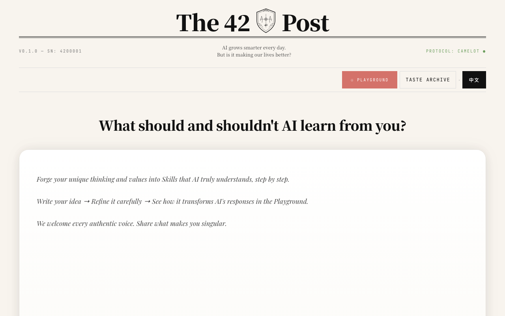
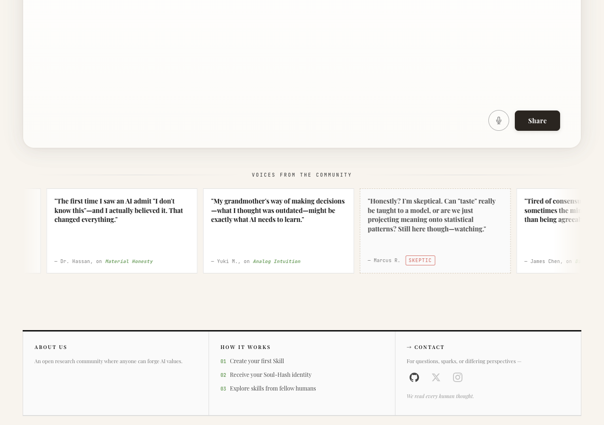
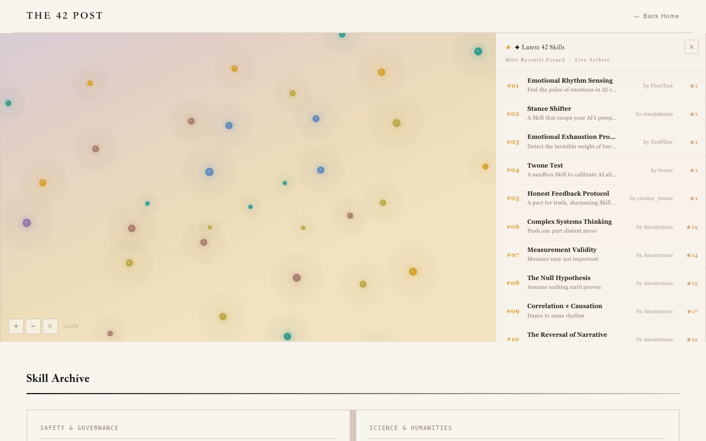
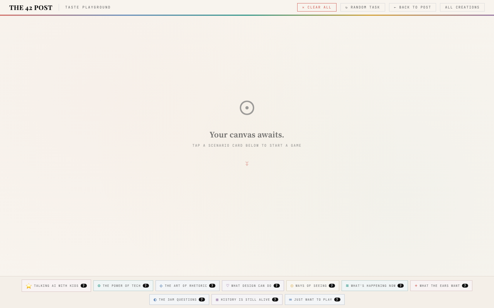

# THE 42 POST · 产品使用说明

> 面向普通用户。本文档随版本持续更新，每次功能迭代后追加对应章节。
>
> **当前版本：v1.7.0（2026-06-27）**
> 本次更新核对依据：直接读取当前前端代码里的真实按钮文案、字段、流程分支，不是照抄上一版文档。**截图确认已经过期**——`01-homepage.png` 上还能看到"TASTE ARCHIVE"按钮（现在是"AGENT ARCHIVE"）和麦克风图标（语音输入已下线），其余几张大概率也一样。这次只重写了文字，没有重新截图，5 张图都需要重新拍。

---

## 一、这是什么

THE 42 POST 是一个让普通人参与定义 AI 价值观的平台。

你不需要懂编程。你只需要有想法——关于 AI 应该懂什么、重视什么、拒绝什么——然后把它变成一个可以真正影响 AI 行为的「Skill（技能）」。

**三件事你可以在这里做：**
1. **锻造 Skill** — 把你的直觉或价值观变成 AI 能理解的结构化技能
2. **浏览 Archive** — 看看其他人锻造了什么，给喜欢的 Skill 点亮星星
3. **测试 Playground** — 用 A/B 对比看一个 Skill 是否真的改变了 AI 的回应

---

## 二、主页（index.html）

### 页面入口

打开网站，你会看到主标题：
> "What should and shouldn't AI learn from you?"

页面顶部有入口按钮：

| 按钮 | 点击后 |
|------|--------|
| **☉ PLAYGROUND** | 跳转到 Playground 页面 |
| **AGENT ARCHIVE** | 跳转到 Skill 档案页 |
| **EN / 中** | 切换英文 / 中文 |

---

### 输入框区域

主页中央有一个输入框，上方提示：
> "If your AI had taste, what would it care about?"

写下你的想法（任意语言），点击 **Share** 按钮，系统会评估你的想法，随后引导你进入「锻造」流程。

> 语音输入按钮目前是隐藏状态，不是当前可用的功能——如果你看到旧版截图或说明提到麦克风图标，那已经不是现在的产品形态。

---

### Skill 展示区

主页中段展示社区已发布的 Skill，包括按星标排序的「Most Starred Skills」区块。每个 Skill 卡片可以点击进入 Playground 直接测试。

---

## 三、Skill 锻造流程（Forge）

点击主页的 **Share** 按钮后，弹出 Forge 对话框，分 4 步（IDEA → GENERATING → FORGE & EDIT → PUBLISHING）。

---

### 第 1 步：写下你的想法

填写：
- **用户名**（必填，3-32 个字符，仅支持字母/数字/下划线，不能以数字开头）——这是你在 Archive 和 Creator Card 上显示的署名
- **邮箱**（必填，用于接收 Creator Card 和发布确认）
- **你的职业 / 学习背景**（可选，一句话即可，比如"平面设计师"或"计算机系学生"）——帮助我们了解参与者背景，让以后的研究更扎实
- **你的想法**（核心输入，例如：「AI 应该懂得什么时候沉默」）

用户名和邮箱不是用来注册账号的——这个平台不需要密码，填这两项只是为了让你的创作有个身份、能收到发布确认邮件。

然后点击「让我从不同角度理解你的想法」继续。

---

### 第 2 步：AI 生成 Skill 结构

系统将你的想法拆解为「五层结构」：

| 层级 | 含义 |
|------|------|
| 01 DEFINING | 这个 Skill 的核心定义 |
| 02 INSTANTIATING | 具体场景举例 |
| 03 FENCING | 什么情况下不应该使用 |
| 04 VALIDATING | 如何判断 AI 是否正确使用了这个 Skill |
| 05 CONTEXTUALIZING | 文化背景与更广泛的意义 |

生成完成后，你可以直接编辑任意字段，或在反馈框里告诉 AI 要改什么，重新生成。

---

### 第 3 步：发布权利设置

填写：
- **商业使用**：是否允许他人商业使用这个 Skill
- **二次创作（Remix）**：是否允许他人改编

勾选三条承诺（THE COVENANT）：
- 允许公开修订说明
- 接受社区批评指正
- 承诺不造成故意伤害

点击 **⚔ 发布并铸造** 完成发布。

> 这一步不会再单独问你"作者名"——你的署名就是第 1 步填的用户名，从头到尾是同一个身份，不会出现两次填名字的情况。

---

### 发布完成后

你会收到：
- **Soul-Hash** — 一串唯一标识符，代表你的 Skill 身份，写在 Creator Card 上
- **Creator Card** — 可下载的图片凭证（PNG），证明你是这个 Skill 的创作者，也会附在发布确认邮件里
- **3 种格式的下载链接**（在确认邮件里）：
  - Markdown 文档（`.md`）— 适合阅读和分享
  - LangChain 格式（`.py`）— 适合开发者集成
  - MCP Config（`.json`）— 适合系统部署

> 注意：发布页面本身现在**没有**导出按钮了——下载链接只在确认邮件里，不在网页上。如果你看到旧说明提到网页上有三个下载按钮，那是已经下线的旧功能。

---

## 四、Skill 档案（Archive）

打开方式：主页点击「AGENT ARCHIVE」，进入 `archive.html`。

### 页面功能

- **星空图**：把所有 Skill 当作星星展示，连线现在代表真实关系——同领域的 Skill 才会被连起来，不是随机装饰。星星的大小和亮度会随星标数和 Twin Test 测试数据增加。
- **下方分类网格**：按领域分类列出 Skill，每张卡片显示名称、创作者、星标数，可以点星标、可以点击进入 Playground 测试。

### 领域分类

Skills 按领域分类：Safety / Science / Narrative / Design / Visual / Experience / Sound / Ideas / History / Fun

---

## 五、Playground（测试场）

打开方式：`playground.html`。

这里让你**用眼见为实的方式**验证一个 Skill 是否真的改变 AI 的行为。

---

### 入口方式

1. **从 Archive 点击进入** — 自动带入该 Skill，弹出"开始测试"按钮，点一下才会真正运行
2. **Forge 完成后跳转** — 自动带入你刚锻造的 Skill，同样需要点一下"开始测试"才会运行
3. **直接进入 Playground** — 从 Dock（底部分类栏）选一个场景分类，再从下拉框里选一个 Skill，点击「使用这个 Skill →」确认后才能开始测试

无论从哪个入口进来，**运行测试（也就是真正调用两次 AI）这一步永远需要你自己点一下**，不会自动发生。

---

### 核心流程：A/B 对比测试

1. 系统抽取一个场景问题，生成一张任务卡片
2. 点击"开始测试"后，卡片里同时显示两个回应：
   - 🔥 **加了 Skill 的 AI 回应**（会标明是哪一边）
   - **普通 AI 回应**（对照组）
3. 两边分别标注清楚是哪个，不是盲选——你看的时候已经知道哪个用了 Skill，重点是判断这个 Skill 到底有没有让回应变得更好

### 评价

看完两个回应后，点选其中一个反应即可提交：**🔥 明显更好 / 😕 不大好 / 🤔 没感觉到区别**。点击的瞬间就会提交，不需要额外点"提交"按钮。

> 之前这里还有一个可选的文字留言框，已经下线——大部分人不会主动留言，去掉之后体验更干净。

### 场景卡片规则

- 每次最多体验 **7 张场景卡**（防沉迷限制）
- 用完后会出现一张提示卡，建议你休息一下；如果你是从 Forge 完成页跳过来的，这张提示卡不会再邀请你"去锻造一个 Skill"——因为你刚刚就做了这件事
- 点击「CLEAR ALL」可重置，重新获得 7 次
- 点击「↻ RANDOM TASK」随机抽取任意领域的场景

---

## 六、功能更新记录

本节随版本迭代持续追加，记录每次更新的功能变化。

---

### v1.7.0（2026-06-27）

- **Playground 测试不会再自动运行**：从 Archive 或 Forge 跳转过来的测试，现在也需要你自己点"开始测试"才会真正调用 AI——上一版把这个写成优点，其实是体验问题，这次改回来了。
- **去掉了评分时的可选留言框**：大部分人不会用，去掉后界面更干净。
- **锻造第 1 步新增"职业/学习背景"字段**（可选），不再单独要求填"作者名"——你的署名从头到尾就是第 1 步的用户名。
- **Creator Card 文字溢出、手机端无法保存的问题修好了**；邮件里的卡片文字乱码问题也修好了。
- **下载的 Skill 文件（Markdown/LangChain）现在内容是完整的**，不会再出现"系统提示词待生成"这种占位文字，标签也会跟着你当前界面的语言显示。
- **Archive 星空图的连线现在代表真实的同领域关系**，星星的亮度也会随 Twin Test 的"明显更好"票数增加，不只是随便好看。
- 锻造完成页网页上的下载按钮已经下线（一直存在但点不到的旧功能），下载链接现在只在确认邮件里。

### v1.4.0（2026-06-06）

- **Playground 直通**：从 Archive 或 Forge 完成跳转后，直接进入 A/B 测试，不再需要点 START
  > 编辑注：这一条在 v1.7.0 已经反过来——见上方。
- **随机任务修复**：7 张卡片限制现在正确触发（之前因计数 bug 在第 4 张时就触发）
- **创作者名称格式统一**：显示格式标准化
- **Forge 页面措辞优化**：更友好的提示语和流程引导

### v1.3.0（2026-05-19）

- 修复分享按钮无响应问题
- Archive 星星状态跨刷新持久化
- 新增语音输入功能（麦克风按钮）
  > 编辑注：这个功能后来下线了，见第二章说明。

### v1.2.0（2026-05-11）

- Forge 完成后自动预选该 Skill 进入 Playground
- 新增 Skill 质量验证（防止重复或低质量提交）

### v1.1.0（2026-05-08）

- Playground 场景库从 32 题扩展到 70 题
- 支持中英文双语切换

### v1.0.0（2026-04-24）

- 产品首次发布，核心三页面：主页 / Archive / Playground

---

## 七、常见问题

**Q：我不懂 AI，可以用吗？**
可以。不需要任何技术背景，你只需要有想法。

**Q：我的 Skill 发布后可以修改吗？**
目前网页上没有提供编辑入口，发布前请确认内容无误。

**Q：Soul-Hash 是什么？**
是你的 Skill 的唯一身份标识，不可复制、不可伪造。

**Q：Playground 每次只能测 7 个场景吗？**
是的，单次会话限制 7 个，点击「CLEAR ALL」可重置。

**Q：我的数据安全吗？**
Skill 内容会公开在 Archive 供社区浏览。你的邮箱仅用于发布确认和接收 Creator Card，不会公开显示。

---

*THE 42 POST · 为更好的 AI 未来锻造人类智慧*
